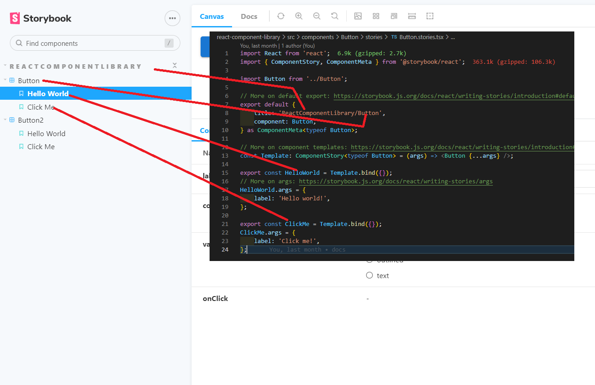
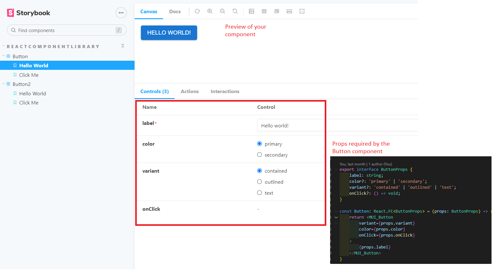
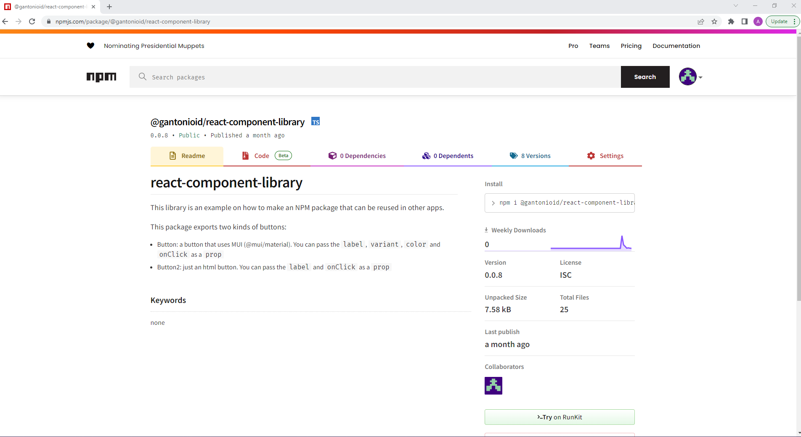

# How to create an NPM package of a React component

> Full tutorial: https://dev.to/alexeagleson/how-to-create-and-publish-a-react-component-library-2oe

## Overview
Create your files and folders like so:
```cmd
-root
|-src
|  |-components
|  | |-MyComponent
|  | | |-index.ts
|  | | |-MyComponent.tsx //a module
|  | |-index.ts //exports all modules
|  |-index.ts //exports your package
```

So basically your component (module) is in `MyComponent.tsx` and you import/export it in its own `index.ts`. Example: Circle

Then you import all of your modules from their correspondig directory and export them all from a file `index.ts` at a higher level. This file will map the imports of the shapes (Circle, Triangle, Square) to the file that defines it. This is just a way to better-organize the package.

Finally do 
```tsx
export * from './components';
```
at the highest level `index.ts` to expose your modules as a part of the package.

## A component's content

The component itself shoud take care of its desired behaviour. Using as many files as needed (style, helpers, services, etc).

### Tests
A subdirectory `tests` is suggested for every component, where the tests are written using `jest` and `@testing-library/react`.

### DEMOS (Storybook)
A subdirectory `stories` is suggested for every component, so the main behaviour(s) of the component can be demonstrated to a fellow developer/designer.

### NPM publish
This is required in your `package.json` because private packages need a credit card $$$

> This means the package will be public!!

```json
{
    ...
    "publishConfig": {
        "access": "public"
    },
    ...
}
```

Before a publish, you should update your package's version in the `package.json` file

## Tutorial

### Workspace setup
1. Create a GitHub repository `my-cool-component` and clone it in your machine.
2. Within the cloned repo (in your machine) create a folder and Initialize a NodeJS project `npm init -y`
3. Add Typescript to your project, creating a `tsconfig.json` file with these contents
```json
{
  "compilerOptions": {
    "target": "es2016",
    "esModuleInterop": true,
    "forceConsistentCasingInFileNames": true,
    "strict": true,
    "skipLibCheck": true,
    // Settings for our react component
    "jsx": "react",
    "module": "ESNext",
    "declaration": true,
    "declarationDir": "types",
    "sourceMap": true,
    "outDir": "dist",
    "moduleResolution": "node",
    "allowSyntheticDefaultImports": true,
    "emitDeclarationOnly": true
  }
}
```
4. Create `src/index.ts` that will export all of our components to the outside world.
```ts
export * from './components';
```
5. Create a `src/components/Button/Button.tsx` that defines our component.
[Button.tsx](./react-component-library/src/components/Button/Button.tsx)
Then export it from an index within the same directory `src/components/Button/index.ts`
```tsx
export { default } from './Button';
```

> It is up to you what this component will do. Add as many files as needed for styles, data processing, api calls, sub-components, etc.

6. Create a `src/components` folder with an `index.ts` that exports all the components that will be part of our package
```ts
export { default as Button } from './Button';
/** export { default as Other } from './Other'; **/
```
### Dependencies
Please think twice of what you add as a dependency. There are several types of dependencies, and they will be part of your `package.json`. They are all needed for your package to work, with a few differences.
- `dependencies`: Totally needed, they will be installed when your package is downloaded to a project that uses it.
- `devDependencies`: Needed only for development, these are skipped in the build phase to make the production bundle lighter.
- `peerDependencies`: You could say they are similar to dependencies **BUT** it is likely that the host project already has them. For example, `react` and `react-dom` should already be installed in a react web app, so there is no need to install them again... simply tell the system to use the existing dependency.

> You may need to set `npm config set legacy-peer-deps true`

### Preview (Storybook)
Storybook is a a tool for visualizing UI components outside of your site / application. It's fantastic for prototyping and testing different visual states of components to ensure they work the way they are designed to, without the extra overhead of having other unrelated components on the screen.

It also gives you an easy way to see and use your components while working on them in your library project, without having to build an unnecessary testing page just to display them.

Add and configure storybook to your project
```ps1
npx sb init --builder webpack5
```

This will create some templates that you may not need but are useful as an example of how to create stories. You may delete them and just keep the `./storybook` folder at the root of your project. 

Create stories for your components. See [Button stories](./react-component-library/src/components/Button/stories/Button.stories.tsx) for examples.




Launch storybook by running `yarn storybook` (script needed in [package.json](react-component-library/package.json))

### Tests
You may add jest tests to your components. This will not be covered by the tutorial. You may explore however these references
- [Button.test.tsx](react-component-library/src/components/Button/tests/Button.test.tsx)
- [jest.config.js](react-component-library/jest.config.js)
- [package.json](react-component-library/package.json) (scripts and devDependencies)
- [babel.config.js](react-component-library/babel.config.js)

### Packaging
Next we will add rollup to our project. If you've never used rollup before, it's very similar to webpack in that it is a tool for bundling individual Javascript modules into a single source that a browser is better able to understand.

Though both tools can accomplish the same goal depending on configuration, typically webpack is used for bundling applications while rollup is particularly suited for bundling libraries (like ours). That's why we've chosen rollup.

Also similar to webpack, rollup uses a plugin ecosystem. By design rollup does not know how to do everything, it relies on plugins installed individually to add the functionality that you need.

We are going to rely on four plugins for the initial configuration of our library (more will be added later):

- `@rollup/plugin-node-resolve` - Uses the node resolution algorithm for modules
- `@rollup/plugin-typescript` - Teaches rollup how to process Typescript files
- `@rollup/plugin-commonjs` - Converts commonjs modules to ES6 modules
- `rollup-plugin-dts` - rollup your .d.ts files

> NOTICE: To handle correctly peer dependencies (such as MUI or others) we also add `rollup-plugin-peer-deps-external` see [rollup.config.mjs](react-component-library/rollup.config.mjs)

To launch the rollup task run `npm run rollup` (script needed in [package.json](react-component-library/package.json))

### Publishing
1. Create a `.gitignore` file excluding `node_modules` and `dist` folders.
```
dist
node_modules
```
2. Set your package name `package.json`. You should check the npm registry for duplicates.
```json
{
  "name": "@YOUR_GITHUB_USERNAME/YOUR_REPOSITORY_NAME",
  ...  
}
```
3. NPM tokens. You need a `.npmrc` file in `C:\Users\{YOUR_WINDOWS_USERNAME}` with these contents
```
//registry.npmjs.org/:_authToken=YOUR_AUTH_TOKEN
legacy-peer-deps=true
```

> Create `YOUR_AUTH_TOKEN` in https://npmjs.com, login into your account and then go to `settings/Access Tokens`
4. For public packages, set "publishConfig" in [package.json](react-component-library/package.json)
```json
{
    ...
    "publishConfig": {
        "access": "public"
    }
    ...
}
```
> Private packages require a credit card $$ or more complex settings not covered in this tutorial

Before you continue, do one more sanity check to be sure you didn't create the `.npmrc` file in the root directory of your actual library project. This is technically an option, however the reason you need to be careful is that you could accidentally commit it to your Github repository with the rest of your library code and expose your token to the public. If your `.npmrc` file is in your home directory the risk of this is minimized.

5. It is always good to check if everything is OK before publishing. Test your build with a dry run
```
npm publish --dry-run
```
This will do a simulation of a publish, without actually publishing the package. Consider running your jest tests or other tasks automatically before publishing setting up the `prepublishOnly` script in [package.json](react-component-library/package.json)
```json
{
    ...
    "scripts": {
        "rollup": "rollup -c",
        "test": "jest",
        "storybook": "start-storybook -p 6006",
        "build-storybook": "build-storybook",
        "prepublishOnly": "yarn test && yarn rollup"
    },
}
```

6. Deploy!
```
npm publish
```
Congratulations! You have now published version 0.0.1 of your React component library! Seach npmjs.com for your package `@YOUR_GITHUB_USERNAME/YOUR_REPOSITORY_NAME`




7. For next builds you need to update the package version before publishing.
```
npm version patch
```
That will automatically upgrade the "version" field in your `package.json`